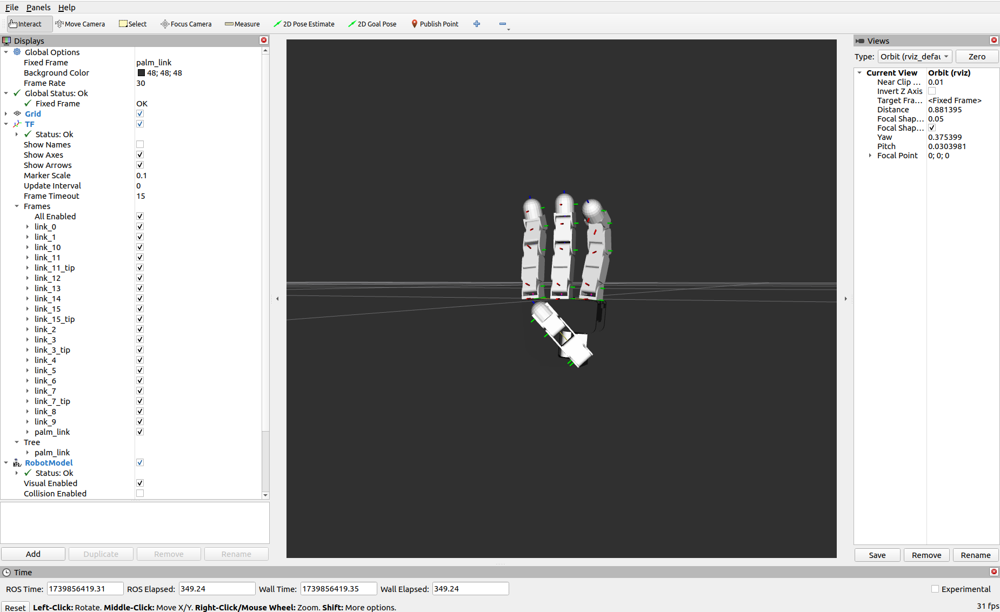

# ROS2 API

This repository is the official release for controlling the **Allegro Hand V4** using **ROS2 Humble** on **Ubuntu 22.04**.

Make sure that you are following well with [**Setup** in README.md](../README.md#setup).

## Install ROS2 Humble

Follow the official [ROS2 Humble installation guide](https://docs.ros.org/en/humble/Installation.html).

## Build ROS2 package


```bash
cd ros2_source
colcon build --symlink-install
source install/setup.bash
```


## File Structure

```
.
└── ros2_source
    └── src
        ├── allegro_hand_controllers
        │   ├── launch
        │   │   ├── allegro_hand.launch.py
        │   │   └── allegro_viz.launch.py
        │   ├── package.xml
        │   ├── CMakeLists.txt
        │   ├── rviz
        │   └── src
        ├── allegro_hand_description
        ├── allegro_hand_driver
        ├── allegro_hand_keyboard
        ├── allegro_hand_parameters
        └── bhand
```

## First Run

### Quick Start with the `Right` Hand

> If you have a left-hand model, change `HAND:=left`.


To run the Allegro Hand, you need **two terminal windows**:
- **Terminal 1**: Launches the hand controller.
  ```bash
  ros2 launch allegro_hand_controllers allegro_hand.launch.py
  ```
- **Terminal 2**: Starts the keyboard input interface.
  - remapping command: **`--ros-args -r /allegroHand/lib_cmd:=/allegroHand_0/lib_cmd `**
  ```bash
  ros2 run allegro_hand_keyboards allegro_hand_keyboard --ros-args -r /allegroHand/lib_cmd:=/allegroHand_0/lib_cmd
  ```

✅ **Successful Launch**

Congratulations on successfully running the Allegro Hand V4! 🎉

<center>

</center>


If the command executes correctly, you should see **Allegro Hand status information** in the terminal logs:

```bash
[ INFO] [<timestamp>]: >CAN(<CAN_ADDRESS>): AllegroHand hardware version: <HARDWARE_VERSION>
[ INFO] [<timestamp>]:                       firmware version: <FIRMWARE_VERSION>
[ INFO] [<timestamp>]:                       hardware type: <HARDWARE_TYPE>
[ INFO] [<timestamp>]:                       temperature: <TEMPERATURE> (celsius)
[ INFO] [<timestamp>]:                       status: <STATUS_CODE>
[ INFO] [<timestamp>]:                       servo status: <SERVO_STATUS>
[ INFO] [<timestamp>]:                       high temperature fault: <FAULT_STATUS>
[ INFO] [<timestamp>]:                       internal communication fault: <FAULT_STATUS>
[ INFO] [<timestamp>]: >CAN(<CAN_ADDRESS>): AllegroHand serial number: <SERIAL_NUMBER>
```

**Troubleshooting**

- ❌ **Launch Command Fails:**
  - Refer to the **Setup** section and verify all steps.
  - If the issue persists, report it in the **Issues** section.

- ❌ **Launch Succeeds, but the Hand Does Not Respond:**
  Check the following:
  - 🔌 **Power connections** – Ensure the hand is powered on.
  - ⚡ **PCAN driver** – Verify installation and connection.


## Source

This section explains the **source code structure**, focusing on **launch files** and **packages**.

### 🚀 Launch File (Main Entry Point)

This release introduces a **single** launch file, `allegro_hand.launch.py`, to start the hand.

```bash
ros2 launch allegro_hand_controllers allegro_hand.launch.py
```

#### Optional (Recommended) Arguments:
| Argument         | Values | Description |
|-----------------|--------|-------------|
| `NUM`           | `0`, `1`, ... | Hand number (default: `0`). |
| `CONTROLLER`    | `grasp`, `pd` | Selects the control mode. |
| `CAN_DEVICE`    | `can0` | Specify a CAN device manually  |
| `VISUALIZE`     | `true`, `false` | Launch RViz for visualization. |
| `JSP_GUI`       | `true`, `false` | Show the `joint_state_publisher` GUI for desired joint angles. |

After launching the controller, start the keyboard input by running:

```bash
ros2 run allegro_hand_keyboards allegro_hand_keyboard --ros-args -r /allegroHand/lib_cmd:=/allegroHand_0/lib_cmd
```

### 📦 Packages Overview

#### Main Package: `allegro_hand_controllers`
This package contains the core control nodes for the Allegro Hand.
The `AllegroNode` class manages generic driver communication, while specific controllers implement `computeDesiredTorque` uniquely.

- **Control Modes**: The available control modes in `allegro_hand_controllers` are:

  | Controller  | Description |
  |------------|-------------|
  | **`grasp`**  | Executes predefined grasping motions with gravity compensation. |
  | **`pd`**     | Joint-space control using PD (Proportional-Derivative) feedback. |
  | **`(others)`** | Work in progress. Contributions welcome! |

#### Additional Packages

- **`allegro_hand_driver`**: Low-level driver for communication with the Allegro Hand.

- **`allegro_hand_description`**: URDF/Xacro descriptions, RViz configurations, and 3D hand meshes.

- **`allegro_hand_keyboard`**: Simple keyboard-based grasp command sender.

- **`bhand`**: Contains predefined grasping library files for both **32-bit** and **64-bit** architectures.
  - ⚠ **Default: 64-bit.** If using a **32-bit system**, update the symlink accordingly.
