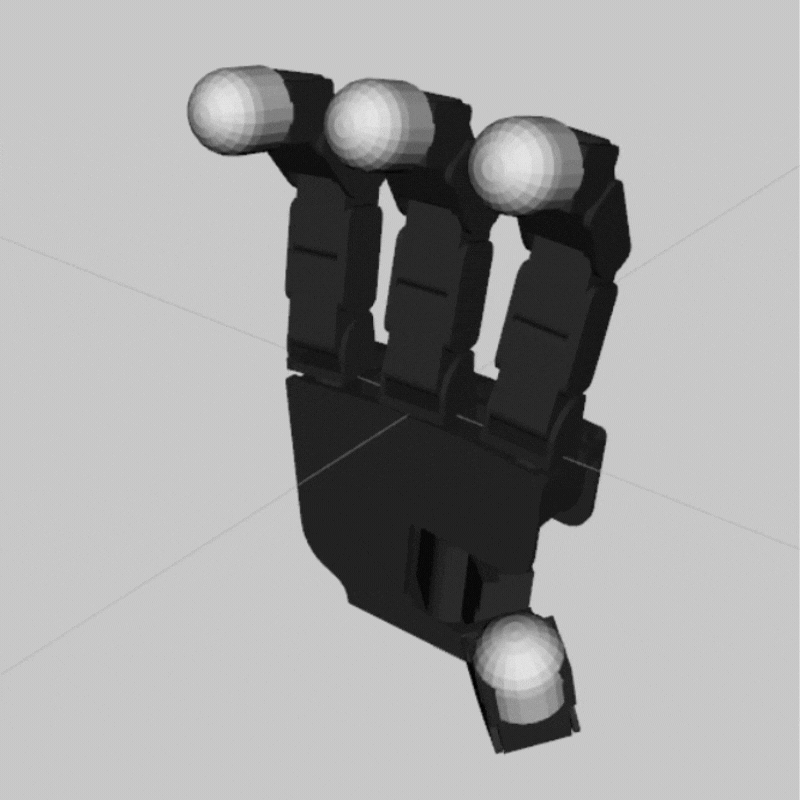
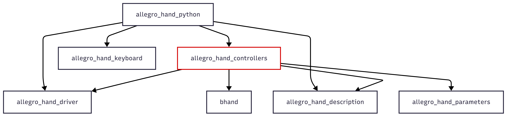

# ROS API

This repository is the official release for controlling the **Allegro Hand V4** using **ROS1 Noetic** on **Ubuntu 20.04**.

Make sure that you are following well with [**Setup** in README.md](../README.md#setup).

## Install ROS1 Noetic

Follow the official [ROS Noetic installation guide](https://wiki.ros.org/noetic/Installation/Ubuntu).

## Build ROS1 packages

```bash
cd ros_source
catkin_make
source devel/setup.bash
```

## File Structure

```
.
└── ros_source
    └── src
        ├── allegro_hand_controllers
        │   ├── launch
        │   │   ├── allegro_hand.launch
        │   │   └── allegro_viz.launch
        │   ├── package.xml
        │   ├── CMakeLists.txt
        │   └── src
        ├── allegro_hand_description
        ├── allegro_hand_driver
        ├── allegro_hand_keyboard
        ├── allegro_hand_parameters
        ├── allegro_hand_python
        └── bhand
```

## First Run

### Quick Start with the `Right` Hand

> If you have a left-hand model, change `HAND:=left`.

```bash
source devel/setup.bash
roslaunch allegro_hand_controllers allegro_hand.launch HAND:=right
```

✅ **Successful Launch**

Congratulations on successfully running the Allegro Hand V4! 🎉

<center>

</center>

If the command executes correctly, you should see **Allegro Hand status information** in the terminal logs:

```bash
[ INFO] [<timestamp>]: >CAN(<CAN_ADDRESS>): AllegroHand hardware version: <HARDWARE_VERSION>
[ INFO] [<timestamp>]:                       firmware version: <FIRMWARE_VERSION>
[ INFO] [<timestamp>]:                       hardware type: <HARDWARE_TYPE>
[ INFO] [<timestamp>]:                       temperature: <TEMPERATURE> (celsius)
[ INFO] [<timestamp>]:                       status: <STATUS_CODE>
[ INFO] [<timestamp>]:                       servo status: <SERVO_STATUS>
[ INFO] [<timestamp>]:                       high temperature fault: <FAULT_STATUS>
[ INFO] [<timestamp>]:                       internal communication fault: <FAULT_STATUS>
[ INFO] [<timestamp>]: >CAN(<CAN_ADDRESS>): AllegroHand serial number: <SERIAL_NUMBER>
```

**Troubleshooting**

- ❌ **Launch Command Fails:**
  - Refer to the **Setup** section and verify all steps.
  - If the issue persists, report it in the **Issues** section.

- ❌ **Launch Succeeds, but the Hand Does Not Respond:**
  Check the following:
  - 🔌 **Power connections** – Ensure the hand is powered on.
  - ⚡ **PCAN driver** – Verify installation and connection.

## Source

This section explains the **source code structure**, focusing on **launch files** and **packages**.

### 🚀 Launch File (Main Entry Point)

This release introduces a **single** launch file, `allegro_hand.launch`, to start the hand.
It accepts several arguments, but at a minimum, you **must specify the handedness**(e.g. `HAND:=right`):

```bash
roslaunch allegro_hand_controllers allegro_hand.launch HAND:=right
```

#### Optional (Recommended) Arguments:
| Argument         | Values | Description |
|-----------------|--------|-------------|
| `NUM`           | `0`, `1`, ... | Hand number (default: `0`). |
| `CONTROLLER`    | `grasp`, `pd`, `velsat`, `torque` | Selects the control mode. |
| `RESPAWN`       | `true`, `false` | Restart the controller if it crashes. |
| `KEYBOARD`      | `true`, `false` | Enable/disable keyboard input (default: `true`). |
| `AUTO_CAN`      | `true`, `false` | Automatically detect the CAN device (default: `true`). |
| `CAN_DEVICE`    | `/dev/pcanusbN` | Specify a CAN device manually (use `ls -l /dev/pcan*` to check available devices). |
| `VISUALIZE`     | `true`, `false` | Launch RViz for visualization. |
| `JSP_GUI`       | `true`, `false` | Show the `joint_state_publisher` GUI for desired joint angles. |

#### Note on `AUTO_CAN`
- The script [**`detect_pcan.py`**](./src/allegro_hand_description/scripts/detect_pcan.py) automatically detects an available `/dev/pcanusb` device.
- If you manually specify a CAN device (`CAN_DEVICE:=/dev/pcanusbN`), **you must set `AUTO_CAN:=false`**.
- ⚠ **Automatic detection does not work when using multiple hands.**


#### Visualization Launch File

- The second launch file `allegro_viz.launch` is for visualization. It is **included** in `allegro_hand.launch` **if** `VISUALIZE:=true`.
- However, if you want to run **RViz separately**, you can launch it manually:
  ```bash
  roslaunch allegro_hand_controllers allegro_viz.launch HAND:=right
  ```
- If you are using **multiple hands** or your hand number is **not 0**, **you must specify the `NUM` parameter** in the visualization launch file.


### 📦 Packages Overview



#### Main Package: `allegro_hand_controllers`
This package contains the core control nodes for the Allegro Hand. The `AllegroNode` class manages generic driver communication, while specific controllers implement `computeDesiredTorque` uniquely.

- **Control Modes**: The available control modes in `allegro_hand_controllers` are:

    | Controller  | Description |
    |------------|-------------|
    | **`grasp`**  | Executes predefined grasping motions with gravity compensation. |
    | **`pd`**     | Joint-space control using PD (Proportional-Derivative) feedback. |
    | **`velsat`** | Velocity saturation-based joint-space control (*experimental*). |
    | **`torque`** | Direct torque control for precise force application. |

#### Additional Packages

- **`allegro_hand_driver`**: Low-level driver for communication with the Allegro Hand.

- **`allegro_hand_python`**: Python client for direct hand control
  - **Usage:**
    ```bash
    roslaunch allegro_hand_python allegro_hand.launch HAND:=right
    ```

- **`allegro_hand_description`**: URDF/Xacro descriptions, RViz configurations, and 3D hand meshes.

- **`allegro_hand_keyboard`**: Simple keyboard-based grasp command sender.

- **`allegro_hand_parameters`**: Stores all configuration parameters, including:
  - **`gains_pd.yaml`** → PD controller gains.
  - **`gains_velSat.yaml`** → Velocity saturation-based control gains.
  - **`initial_position.yaml`** → Default home position of the hand.

- **`bhand`**: Contains predefined grasping library files for both **32-bit** and **64-bit** architectures.
  - ⚠ **Default: 64-bit.** If using a **32-bit system**, update the symlink accordingly.


#### Note on Polling
- The recommended sampling method is using the **hand's built-in real-time clock** (333Hz), which **polls CAN communication** (`polling = true`, default).
- Using ROS’s default interrupt/sleep combination **may cause instability in CAN communication**, leading to **unstable hand motions**.


## Hand Description

To display these instructions in the terminal, run:

```bash
bash src/allegro_hand_description/build_desc.sh -h
```

**Usage of `build_desc.sh`**: It generates the **URDF model** of the Allegro Hand from its **Xacro file**. It accepts up to **two arguments**:

1. **Hand Side(1st Argument)**: It specifies the **hand side** (`right` or `left`). Accepted variations are: `RIGHT`, `Right`, `right`, `R`, `r`, `LEFT`, `Left`, `left`, `L`, `l`
2. **Robot Tree Diagram(2nd Argument)**: It is optional. If set to `1`, displays a **robot tree diagram**. Otherwise, no diagram is shown.

- **Examples**
  - **Build** the **right-hand URDF** and **Display** the **robot tree diagram**: `bash build_desc.sh RIGHT 1`
  - **Build** the **left-hand URDF** and **Do not display** the robot tree diagram: `bash build_desc.sh left`

## Controlling Multiple Hands

When running **more than one Allegro Hand** in ROS, you must **specify the hand number (`NUM`)** when launching.

- **Example: Running Two Hands**

  ```bash
  roslaunch allegro_hand.launch HAND:=right NUM:=0 CAN_DEVICE:=/dev/pcan0 AUTO_CAN:=false

  roslaunch allegro_hand.launch HAND:=left  NUM:=1 CAN_DEVICE:=/dev/pcan1 AUTO_CAN:=false
  ```

- **Known Issues & Limitations**
  - Currently, **most hand-specific parameters** (such as motor/encoder directions and offsets) are stored within **separate namespaces** (`allegroHand_#`).
  - However, the **`robot_description` parameter**, which defines the **kinematic structure** and **joint limits**, is **global**.
    - When launching a **second hand**, the **`robot_description` parameter is overwritten**.
    - At this time, there is **no known method** to create separate **`robot_description` namespaces** for multiple hands. If you have any insights on how to manage **separate `robot_description` parameters** for multiple hands, *please share your suggestions!*

